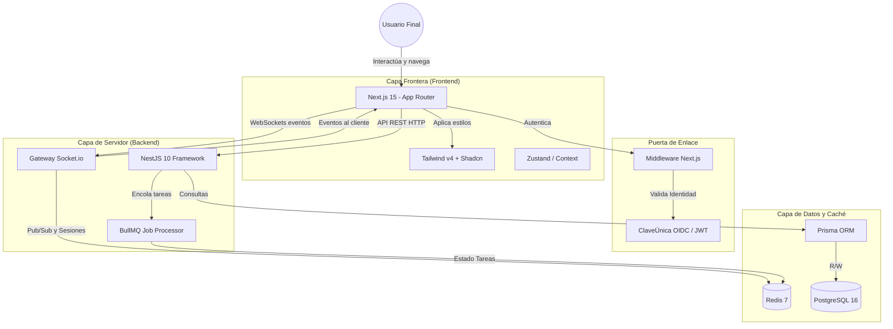

# Arquitectura del Sistema: MiINAPI

Este documento describe la arquitectura del sistema MiINAPI, abarcando desde la visión general estratégica hasta los detalles técnicos de cada capa operativa.

## Tabla de Contenidos
1. [Visión General y Propósito](#1-visión-general-y-propósito)
2. [Diseño de Alto Nivel (High-Level Design)](#2-diseño-de-alto-nivel-high-level-design)
    - [2.1 Diagrama de Flujo y Arquitectura](#21-diagrama-de-flujo-y-arquitectura)
    - [2.2 Capas Arquitectónicas](#22-capas-arquitectónicas)
3. [Estructura de Directorios](#3-estructura-de-directorios)
4. [Arquitectura de Frontend](#4-arquitectura-de-frontend)
5. [Arquitectura de Backend](#5-arquitectura-de-backend)
6. [Capa de Datos y Persistencia](#6-capa-de-datos-y-persistencia)
7. [Infraestructura y Tareas Concurrentes](#7-infraestructura-y-tareas-concurrentes)
8. [Tech Stack (Resumen)](#8-tech-stack-resumen)

## 1. Visión General y Propósito

**MiINAPI** es la plataforma centralizada que moderniza y optimiza los servicios digitales del Instituto Nacional de Propiedad Industrial. El sistema está diseñado para facilitar la gestión de solicitudes, marcas, patentes y notificaciones legales con un enfoque **User-Centric**.

Implementamos una **Arquitectura Desacoplada (Monorepo)** donde el Frontend y Backend evolucionan de forma independiente, garantizando una alta reactividad (con notificaciones en tiempo real) y procesos seguros mediante la validación de identidad (RUT + ClaveÚnica).

## 2. Diseño de Alto Nivel (High-Level Design)

La arquitectura de MiINAPI se basa en un stack moderno de TypeScript de extremo a extremo, facilitando la compartición de tipos y un desarrollo ágil.

### 2.1 Diagrama de Flujo y Arquitectura



### 2.2 Capas Arquitectónicas

| Capa | Tecnología | Responsabilidad |
| --- | --- | --- |
| **Presentation** | Next.js 15 (React) | SSR, App Router, interfaces rápidas y contextuales. |
| **Design System** | Tailwind v4 + shadcn/ui | Tokens de diseño, consistencia visual, accesibilidad. |
| **Orchestration** | NestJS 10 (Node.js) | Lógica de negocio, módulos (Trámites, Soporte). |
| **Real-time** | Socket.io | Empuje de eventos y notificaciones urgentes al cliente. |
| **Persistence** | PostgreSQL 16 + Prisma | Almacenamiento relacional tipado y migraciones. |
| **Cache & Queue**| Redis 7 + BullMQ | Tareas en segundo plano (caducidades, correos). |

---

## 3. Estructura de Directorios

El código reside en un monorepo administrado de la siguiente manera:

```text
/mi-inapi-app
├── /backend                  # Servidor de API (NestJS)
│   ├── /src
│   │   ├── /auth             # JWT y conexión con ClaveÚnica OIDC
│   │   ├── /tramites         # Módulo de solicitudes y patentes
│   │   ├── /notificaciones   # Gateway de WebSockets (Socket.io)
│   │   ├── /certificados     # Generación de documentos
│   │   └── main.ts           # Punto de entrada NestJS
│   ├── /prisma               # Esquemas y migraciones (schema.prisma)
│   └── package.json
│
├── /frontend                 # Cliente Web (Next.js 15)
│   ├── /src
│   │   ├── /app              # App Router (login, dashboard, perfil)
│   │   ├── /components       # UI compartida (BottomNav, ChatIAFab, Cards)
│   │   ├── /lib              # Utilidades compartidas y mock data
│   │   └── middleware.ts     # Protección perimetral de rutas
│   ├── tailwind.config.ts    # Configuración de diseño y tokens
│   └── package.json
│
├── /docs                     # Documentación (PRD, Arquitectura, BD)
└── docker-compose.yml        # Infraestructura (BD, Redis)
```

## 4. Arquitectura de Frontend

El frontend está optimizado para ofrecer una **experiencia de usuario fluida y sin fricción**.

* **Framework:** Next.js 15 utilizando App Router y compilación rápida con Turbopack.
* **Sistema de Diseño:** Basado en tokens rigurosos (`Tailwind v4` + `shadcn/ui`), implementado en un archivo global que maneja tipografía (DM Mono, etc.) y semántica de colores institucional.
* **Componentización:** Alta reutilización (`BottomNav` contextual, `ChatIAFab`, `SemaphoreCard` para urgencias).
* **Navegación:** Renderizado de estados condicional (Estado A/B/C) dependientes del perfil de usuario y de las alertas pendientes, interceptado mediante `middleware.ts`.

## 5. Arquitectura de Backend

Desarrollada con **NestJS 10** por su arquitectura modular inspirada en Angular, fomentando inyección de dependencias (DI) y código testeable.

* **Patrones:** Arquitectura basada en controladores, servicios y módulos, con interceptores para Logging y Guards para la Auth (JWT).
* **Tiempo Real:** Se usa `Socket.io` para notificar proactivamente a los ciudadanos sobre cambios de estado en sus trámites o respuestas en Soporte.
* **Colas de Tareas:** `BullMQ` manejado a través de Redis para procesamiento asíncrono (ej. envío masivo de correos de caducidad, generación demorada de certificados en PDF).

## 6. Capa de Datos y Persistencia

* **ORM:** Prisma 5 provee seguridad de tipos impecable desde la base de datos hasta el front-end a través de relaciones TypeScript generadas automáticamente.
* **Motor:** PostgreSQL 16 proporciona soporte relacional y soporte JSONB para flexibilidad en requerimientos de trámites específicos.
* **Redis:** Actúa como capa de caché de corto plazo, gestor de estado para las colas, y broker de mensajes para clústeres de websockets.

## 7. Infraestructura y DevOps

* **Dockerización:** Empleo de `docker-compose` en local para levantar réplicas exactas de PostgreSQL y Redis.
* **CI/CD:** Automatización vía GitHub Actions (`deploy.yml`) para validaciones de TypeScript y Linting antes de despliegue.

## 8. Tech Stack (Resumen)

| Capa/Categoría | Tecnología | Rol Principal |
| :--- | :--- | :--- |
| **Frontend Core** | Next.js 15, TypeScript | Renderización de vistas, routing en cliente/servidor. |
| **Estilos** | Tailwind CSS v4, shadcn/ui | Sistema de diseño de alta cohesión. |
| **Backend Core** | NestJS 10 | Estructuración del servidor API REST. |
| **Database** | PostgreSQL 16 + Prisma | Almacenamiento definitivo de datos. |
| **Async & Cache** | Redis 7 + BullMQ | Procesos pesados diferidos y manejo de websockets. |
| **Realtime** | Socket.io | Sincronización instantánea de estados al cliente. |
