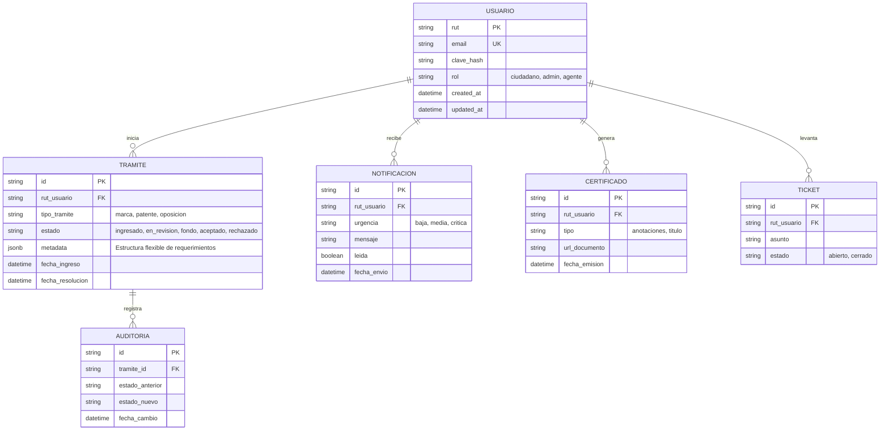

# Diseño de la Base de Datos: MiINAPI

Este documento define la capa de persistencia de MiINAPI. La base de datos está optimizada para la resiliencia legal, alta escalabilidad y actualización en tiempo real del estado de los trámites mediante la combinación de **PostgreSQL 16** y el ORM **Prisma 5**.

## Tabla de contenidos
1. [Modelo Entidad-Relación (ERD)](#1-modelo-entidad-relación-erd)
2. [Especificaciones Técnicas de Campos](#2-especificaciones-técnicas-de-campos)
3. [Estrategia de Rendimiento (Índices)](#3-estrategia-de-rendimiento-índices)
4. [Integridad y Auditoría](#4-integridad-y-auditoría)

## 1. Modelo Entidad-Relación (ERD)

## 2. Especificaciones Técnicas de Campos

### 2.1 Identificadores Inmutables (RUT)
*   **Identificación Primaria (RUT):** A diferencia de sistemas estándar con Integer IDs, en INAPI el RUT (Validado Módulo 11) actúa no solo como identificador primario del usuario de cara al estado, sino como piedra angular para enlazar solicitudes institucionales.

### 2.2 Flexibilidad de Procesos con `JSONB`
El campo `metadata` en la tabla `TRAMITE` permite absorber la complejidad de distintos flujos de propiedad intelectual sin requerir docenas de tablas satélites.
*   *Ejemplo Marca:* `{"denominacion": "MiMarca", "clases": [12, 14], "tipo_marca": "mixta"}`
*   *Ejemplo Patente:* `{"resumen_invencion": "...", "prioridad_internacional": "PCT/US...", "inventores": [...]}`

## 3. Estrategia de Rendimiento (Índices)

Para cumplir con la entrega sub-segundo de la carga del dashboard, se plantean las siguientes estrategias en Prisma:
1.  **B-Tree** en `tramite.rut_usuario`: Permite cargas inmediatas del historial de un usuario al logearse.
2.  **B-Tree** en `notificacion.rut_usuario` filtrado por `leida = false`: Extracción rápida del "setBadge" para la UI de notificaciones urgentes.
3.  **GIN Index** (Postgres) para búsquedas directas dentro del `jsonb metadata`, útil para el panel administrativo (ej: buscar patentes por un PCT internacional específico).

## 4. Integridad y Auditoría

*   **Historial Inmutable:** Dado el contexto legal de dominio de marca, el paso de estados de un `TRAMITE` nunca sobreescribe información crítica al azar. Cada cambio genera un trigger/registro en la tabla de `AUDITORIA`.
*   **Segregación Caching:** Los estados volátiles de sesión (ejem. *typing* en el Chat IA, online status para el ticket de soporte) **NO** tocan PostgreSQL. Se persisten exclusivamente en instancias de **Redis** gestionadas y levantadas vía `docker-compose`. 
