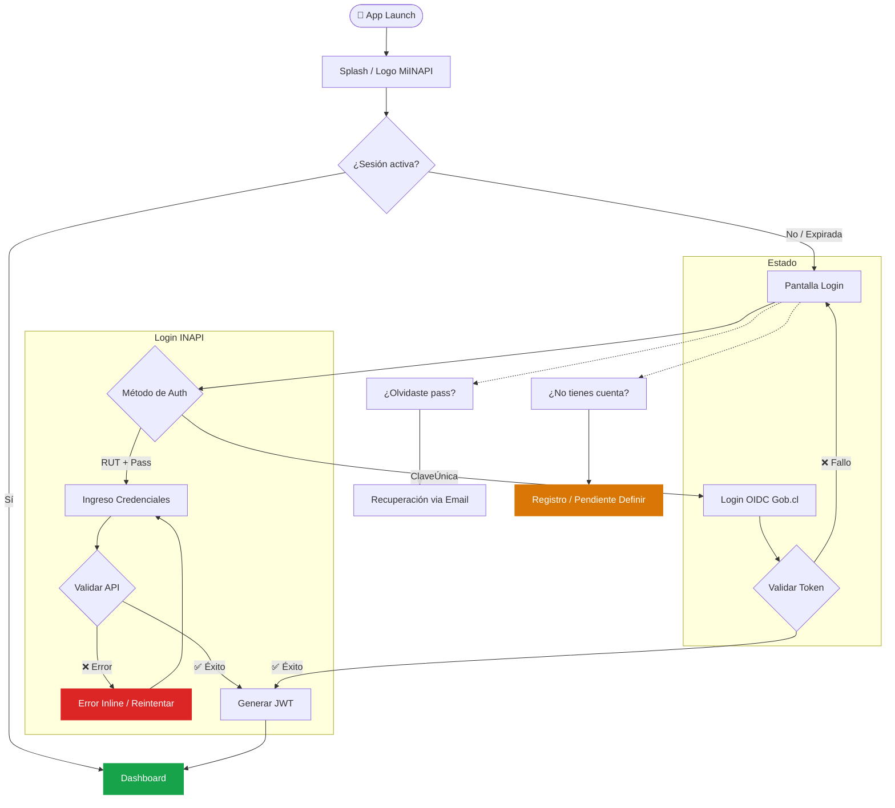
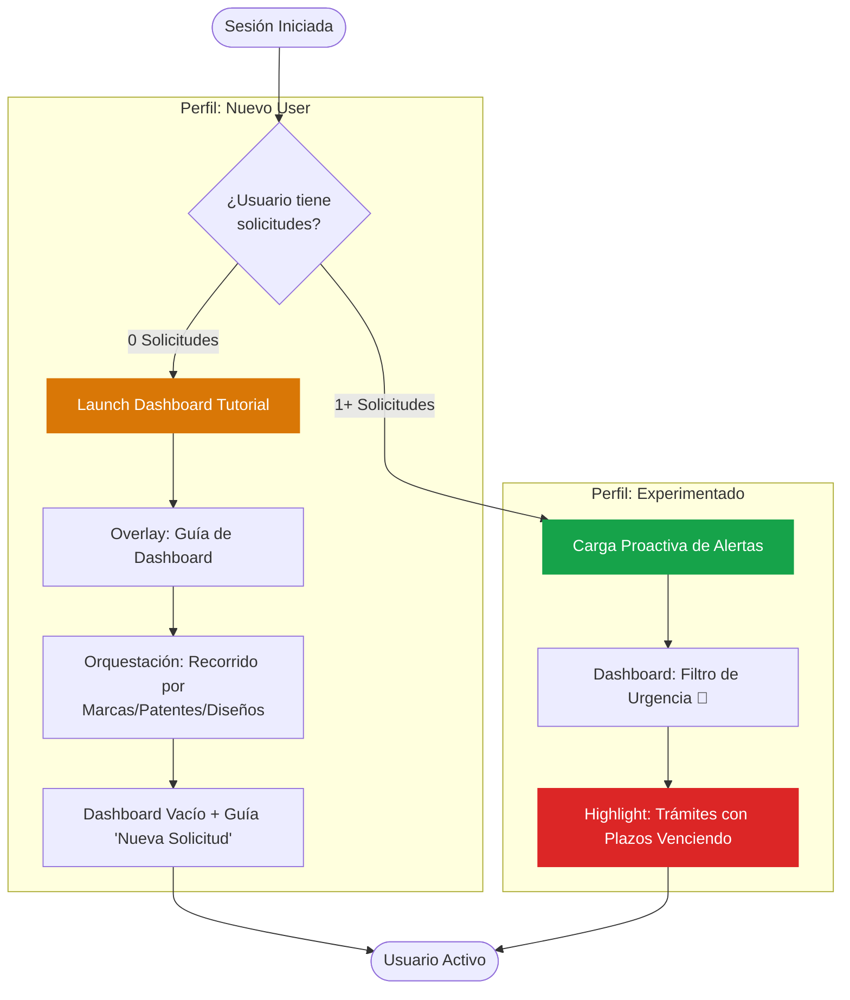
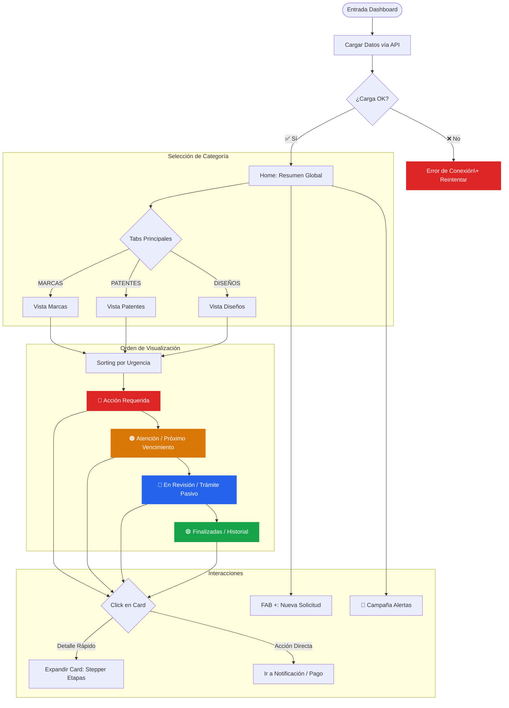
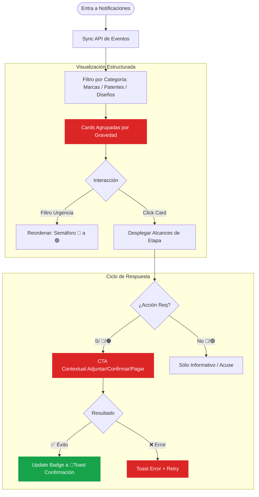
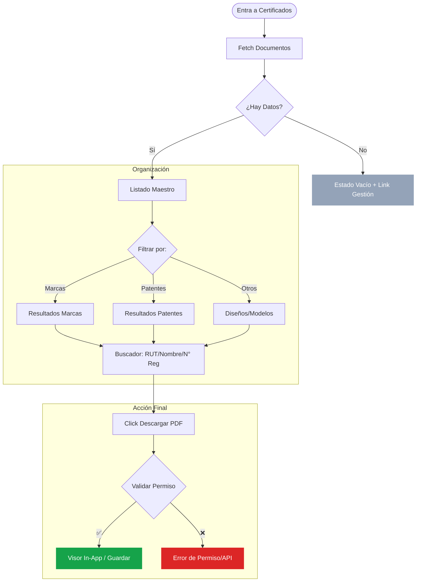
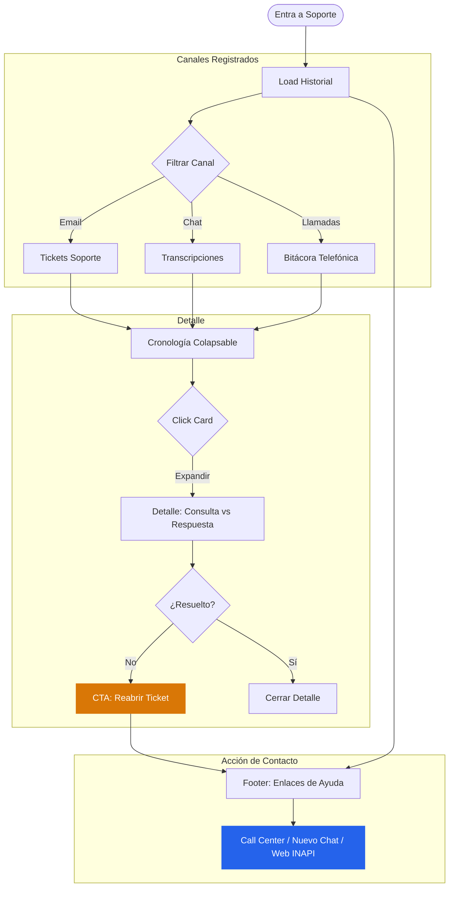
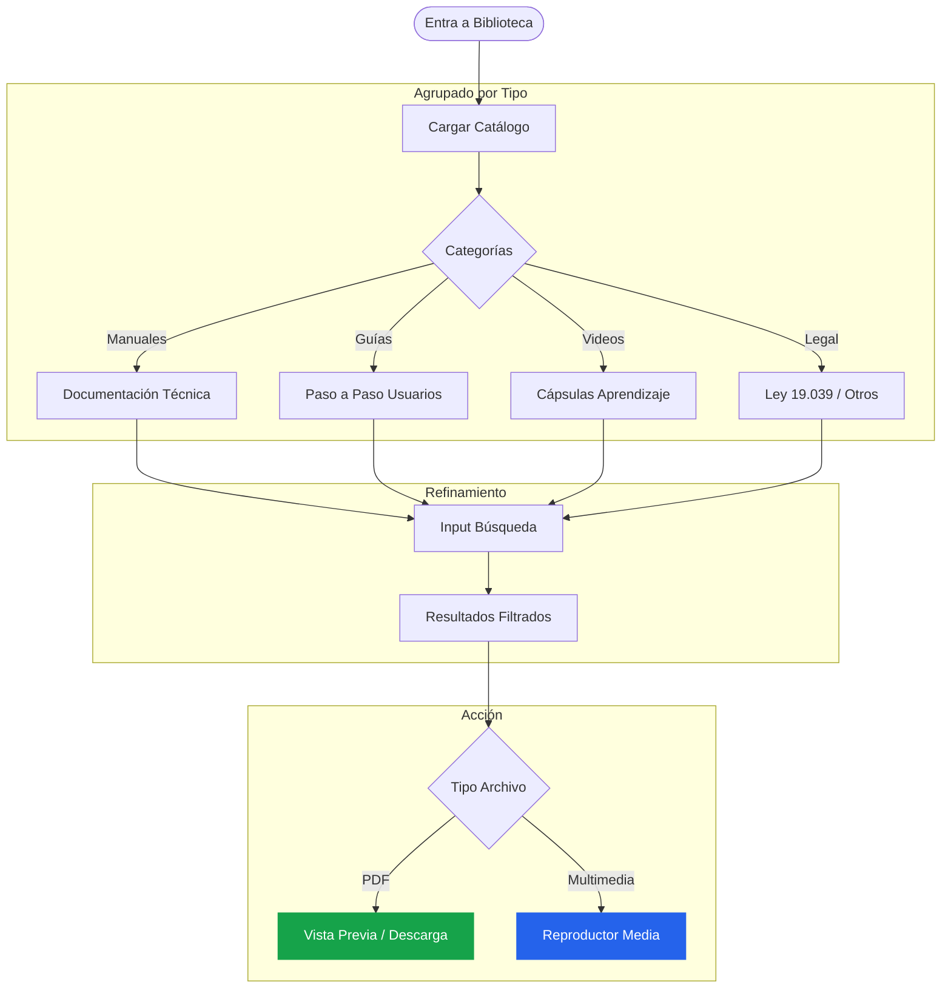
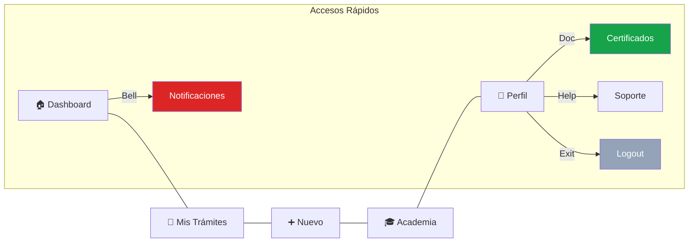

# MiINAPI — Diagramas de Flujo por Pantalla
## MVP Fase 1 · Revisión post-reunión 06/04/2026
### Fernando (UX) · Bernarda (Informática) · Álvaro (Jefe Proyecto CORFO)

---

## 1. Flujo: Login / Autenticación
*Propósito: Acceso seguro y segmentación inicial del usuario.*

---

## 1.5. Flujo: Journey por Segmentación de Usuario
*Lógica de Onboarding diferenciada según el perfil del usuario.*

---

## 2. Flujo: Dashboard Principal
*Centro neurálgico con jerarquía visual por urgencia y categoría.*

---

## 3. Flujo: Centro de Notificaciones
*Gestión de eventos críticos y administrativos.*

---

## 4. Flujo: Certificados Digitales
*Acceso a documentos de propiedad industrial legalmente válidos.*

---

## 5. Flujo: Soporte e Historial
*Canales de comunicación y registro de interacciones pasadas.*

---

## 6. Flujo: Biblioteca de Recursos (Academia)
*Material educativo sobre propiedad industrial.*

---

## Navegación Global (Arquitectura BottomNav)

---

## Notas técnicas para el equipo de desarrollo (UX/FE/BE)

- **Sistemas de Diseño:** Todos los diagramas utilizan el **Sistema Semáforo INAPI**:
    - **Rojo (#DC2626):** Crítico/Urgente/Vencido.
    - **Naranja (#D97706):** Atención/Próximo/Acción Intermedia.
    - **Azul (#2563EB):** Información/Estado Pasivo/En proceso.
    - **Verde (#16A34A):** Éxito/Completado/Vigente.
- **Categorización Transversal:** La división Marcas / Patentes / Diseños es el eje de la data; el FE debe persistir el último Tab seleccionado por el usuario.
- **Performance:** Las llamadas a API de cada flujo deben implementar estrategias de **Caching** y **Optimistic UI** para mejorar la percepción de velocidad.
- **Jerarquía Visual:** El Dashboard y Notificaciones SIEMPRE deben renderizar el contenido **Rojo** en la parte superior (Priorización por Servidor).
