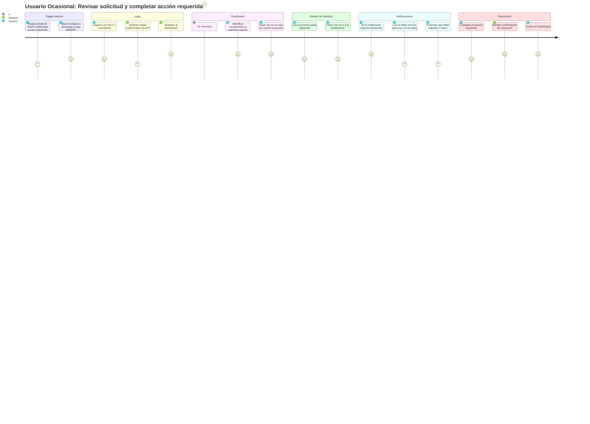
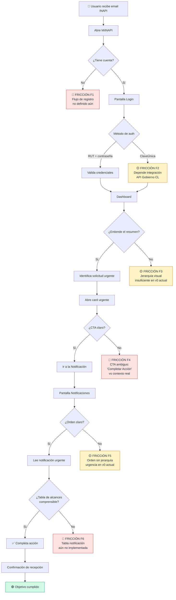
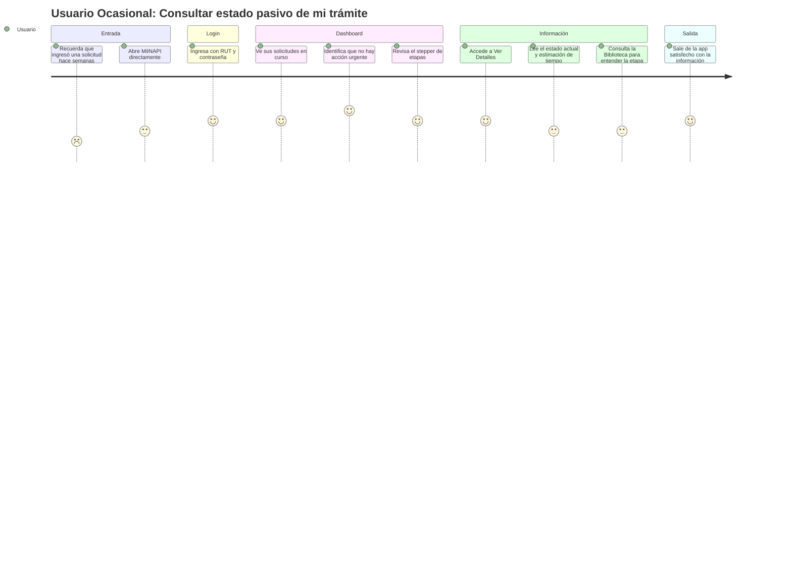

# MiINAPI — User Journey Map
## Usuario Ocasional (Persona Natural) · MVP Fase 1
### Fecha: 6 de abril 2025 · Revisión post-reunión Fernando / Bernarda / Álvaro

---

## Contexto del Usuario

**Perfil:** Persona natural chilena que ingresó una solicitud de marca en el sitio web de INAPI.  
**Motivación:** Saber en qué etapa está su solicitud y qué debe hacer a continuación.  
**Dispositivo:** Smartphone (iOS/Android).  
**Frecuencia de uso:** Esporádica — accede cuando recibe una notificación por correo o cuando recuerda su trámite.

---

## Journey Principal: "Revisar mi solicitud y completar una acción requerida"

---

## Mapa de Fricciones por Pantalla

---

## Inventario de Fricciones Identificadas

| ID | Pantalla | Tipo | Descripción | Impacto | Prioridad |
|----|----------|------|-------------|---------|-----------|
| F1 | Registro | 🔴 Crítica | Flujo de registro no wireframeado. El usuario no puede auto-registrarse desde la app si no tiene cuenta previa. | Alto | P0 |
| F2 | Login | 🟡 Media | Integración ClaveÚnica depende de credenciales sandbox del Gobierno. Proceso burocrático externo. | Medio | P1 |
| F3 | Dashboard | 🟡 Media | Jerarquía visual insuficiente: el usuario no distingue rápidamente qué solicitud requiere acción. | Alto | P1 |
| F4 | Dashboard | 🔴 Crítica | CTA "Completar Acción" no es contextual. Debería adaptarse al tipo de notificación (ej. "Adjuntar documento", "Realizar pago"). | Alto | P0 |
| F5 | Notificaciones | 🟡 Media | Las cartas no siguen orden de urgencia en la versión actual de v0. El usuario no sabe qué atender primero. | Alto | P1 |
| F6 | Notificaciones | 🔴 Crítica | La tabla de alcances de etapa no está implementada. Es el elemento central que comunica qué debe hacer el usuario. | Crítico | P0 |
| F7 | Biblioteca | 🟢 Baja | Usuario novato puede no distinguir la diferencia entre "Manuales" y "Guías". Etiquetas ambiguas. | Bajo | P2 |
| F8 | Certificados | 🟢 Baja | Sin filtro por tipo (Marca/Patente/Diseño), la lista puede crecer sin control en usuarios frecuentes. | Medio | P2 |

---

## Journey Secundario: "Consultar estado sin acción pendiente"

---

## Notas para el equipo

- **Consistencia con emails de TI:** Hasta que el equipo de TI no defina el contenido exacto de las notificaciones por correo, el copy en la app debe ser genérico pero coherente. Trabajar con plantillas de notificación que se puedan parametrizar.
- **Sistema semáforo:** Rojo (urgente/riesgo) → Naranja (atención/requerimiento) → Azul (en revisión) → Verde (finalizado). Este código debe ser consistente en Dashboard, Notificaciones y Stepper de etapas.
- **Pantallas fuera del MVP:** Simulador y Asistente IA quedan para Etapa 2. No wireframear ni desarrollar hasta validar el MVP core.
